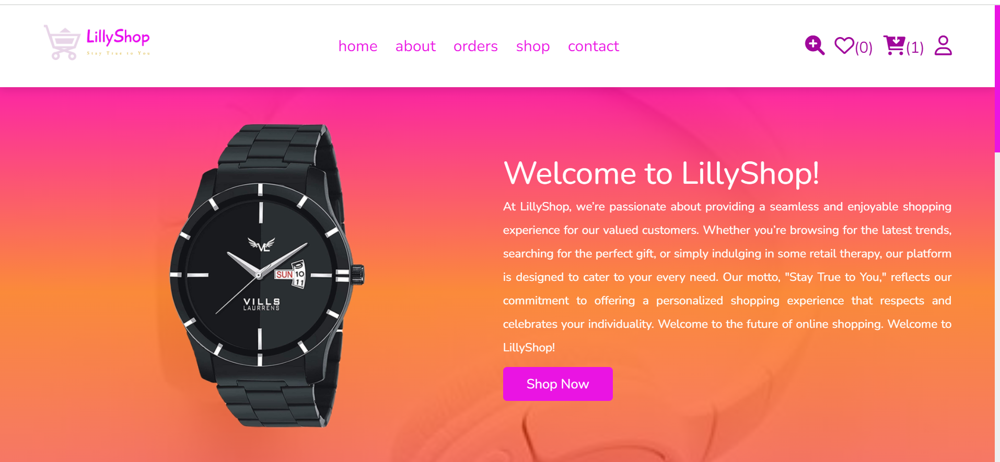

Project Name: LillyShop

Introduction:
LillyShop is an e-commerce platform designed to offer a seamless shopping experience. Built using modern web technologies, it provides a user-friendly interface for customers to browse, select, and purchase products. The platform is built with a focus on high performance, security, and scalability.

Links:
Deployed Site: https://lillyshop.netlify.app/
Final Project Blog Article: Building LillyShop: From Concept to Launch
Author's LinkedIn: https://www.linkedin.com/in/lyndandidiamaka/

Installation:
Clone the repository.
Navigate to the project directory.
Install the required dependencies.
Set up the database.
Start the development server.
Open your browser and navigate to (http://localhost/LillyShop/home.php) to see the project in action.

Usage:
To start using LillyShop, follow these steps:

Register an account or log in with your existing credentials.
Browse through the product categories or use the search bar to find specific items.
Add products to your cart and proceed to checkout.
Enter your shipping details and payment information to complete the purchase.
For detailed usage instructions, refer to our User Guide.

Contributing:
We welcome contributions to LillyShop! If you would like to contribute, please follow these steps:

Fork the repository.
Create a new branch for your feature or bug fix.
Make your changes and commit them with descriptive messages.
Push your changes to your forked repository.
Open a pull request to the main branch of the original repository.
Please ensure your code adheres to our coding standards and includes relevant tests. For more details, refer to our Contributing Guidelines.

Screenshot

